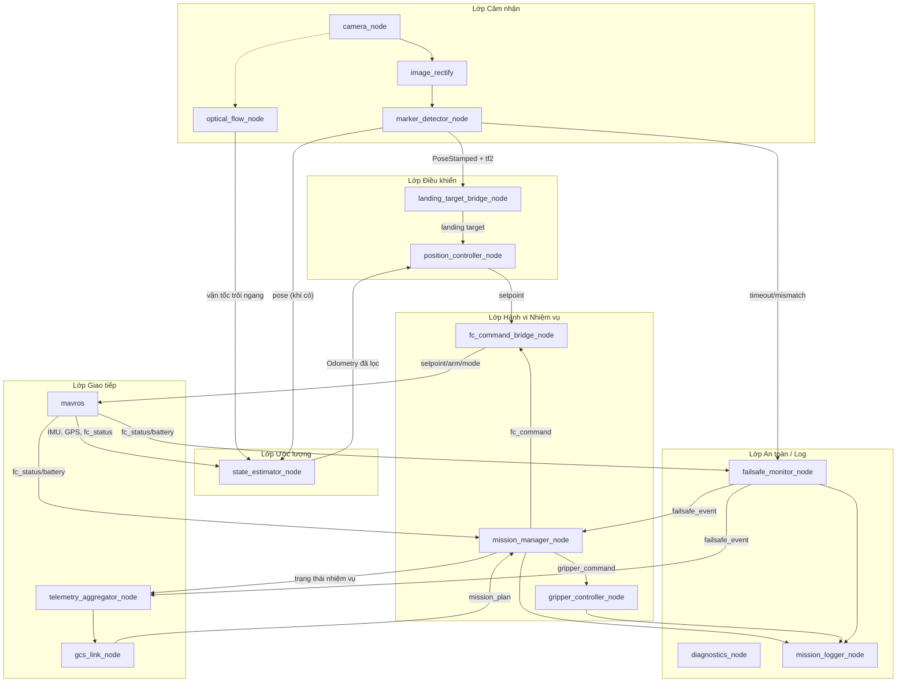

# Phân tích và Đề xuất Kiến trúc Node ROS 2 cho Máy tính nhúng (Companion Computer)

*Tài liệu bổ sung cho `phan_tich_thiet_ke_he_thong_van_chuyen.md`, `thiet_ke_tram_dieu_khien_mat_dat.md`, `thiet_ke_cau_truc_du_lieu_he_thong_drone.md`, `huong_dan_cai_dat_ros2_pi4.md` và `huong_dan_tich_hop_mavlink_H743.md` — cập nhật 06/09/2026*

## 1. Bối cảnh và những điểm cần thống nhất trước khi cứng hoá kiến trúc

Các tài liệu hiện có trong dự án mô tả hệ thống ở hai mức khác nhau, và có ba điểm chưa hoàn toàn khớp nhau giữa chúng — cần chốt lại trước khi thiết kế chi tiết node, vì lựa chọn ở đây ảnh hưởng trực tiếp tới package nào dùng được sẵn và node nào phải tự viết.

Thứ nhất là máy tính nhúng: tài liệu phân tích tổng thể và tài liệu cấu trúc dữ liệu mô tả companion computer là Jetson Nano/Orin Nano, trong khi `huong_dan_cai_dat_ros2_pi4.md` lại cài đặt cụ thể cho Raspberry Pi 4 chạy Ubuntu Server 24.04 + ROS 2 Jazzy. Tài liệu này giả định **Pi 4 là nền tảng hiện hành** (vì đây là tài liệu cài đặt cụ thể nhất và mới nhất), và toàn bộ đề xuất bên dưới tính toán cho tải xử lý của Pi 4 (yếu hơn Jetson đáng kể — cần để ý khi chọn độ phân giải camera và tần số node xử lý ảnh).

Thứ hai là phương pháp định vị tại bãi đáp: tài liệu phân tích tổng thể và cấu trúc dữ liệu thiết kế quy trình dò **mã QR** bằng OpenCV/pyzbar rồi tự viết thuật toán PnP; còn tài liệu cài ROS 2 lại cài `aruco-opencv` và `apriltag-ros` — hai package ROS 2 có sẵn, đã tích hợp ước lượng pose 3D (PnP) và publish thẳng ra `geometry_msgs/PoseStamped` + `tf2`, không cần tự viết PnP. Đề xuất trong tài liệu này là **dùng ArUco/AprilTag làm mốc định vị chính** (mỗi bãi đáp một mã ID riêng, đóng vai trò tương đương "mã QR" trong tài liệu gốc để xác thực đúng điểm), vì việc này tận dụng được package ROS 2 đã kiểm chứng thay vì tự viết lại PnP — tiết kiệm đáng kể công sức và giảm rủi ro lỗi hình học. Mã QR truyền thống (nếu vẫn muốn giữ, ví dụ để hiển thị thông tin điểm cho người thao tác đọc bằng mắt/điện thoại) có thể tồn tại song song trên cùng bãi đáp nhưng không cần một node ROS 2 riêng để giải mã nó cho mục đích dẫn đường.

Thứ ba là đường liên lạc với GCS: tài liệu tích hợp MAVLink trên STM32H743 mô tả USART3 là kênh MAVLink **trực tiếp** giữa FC và GCS (qua radio telemetry), tách biệt hoàn toàn với USART2 (FC ↔ Pi 4). Nếu giữ nguyên như vậy, các lệnh nhiệm vụ cấp cao kiểu "lấy tại A, giao tại B" mà GCS gửi cho *máy trạng thái nhiệm vụ* (chạy trên Pi 4, không phải trên FC) sẽ không có đường đến đích trừ khi FC đóng vai trò chuyển tiếp (forward) các bản tin nhiệm vụ tuỳ biến từ COMM_1 sang COMM_0. Đây là một quyết định kiến trúc cần chốt: (a) để FC forward bản tin nhiệm vụ tuỳ biến giữa hai cổng MAVLink của nó, hoặc (b) cho Pi 4 có đường liên lạc GCS riêng (module 4G/LTE gắn trực tiếp vào Pi 4, độc lập với radio telemetry của FC). Phương án (b) đơn giản hơn về phần mềm (không phải sửa firmware FC để forward) và cũng khớp với câu "module 4G/LTE cho tầm xa" đã liệt kê như một lựa chọn phần cứng độc lập trong tài liệu phân tích tổng thể, nên tài liệu này thiết kế node giao tiếp GCS theo phương án (b), có ghi chú phương án (a) như lựa chọn thay thế.

## 2. Nguyên tắc tổ chức node

Kiến trúc chia thành sáu lớp trách nhiệm, mỗi node đảm nhiệm đúng một việc để dễ kiểm thử độc lập và dễ thay thế (ví dụ đổi ArUco sang AprilTag không ảnh hưởng các lớp phía trên): lớp cảm nhận (Perception), lớp ước lượng trạng thái (Estimation), lớp điều khiển (Control), lớp hành vi nhiệm vụ (Mission/Behavior), lớp giao tiếp (Communication — tách FC và GCS), và lớp an toàn/ghi log (Safety & Logging). Các node nên được nhóm thành nhiều package ROS 2 theo đúng sáu lớp này (`drone_perception`, `drone_estimation`, `drone_control`, `drone_mission`, `drone_comms`, `drone_safety`, cộng thêm `drone_bringup` cho launch file và `drone_interfaces` cho message/service tuỳ biến), thay vì gộp tất cả vào một package lớn.

## 3. Sơ đồ luồng dữ liệu tổng thể



## 4. Danh sách node đề xuất và yêu cầu tính năng

### 4.1 Lớp Cảm nhận (`drone_perception`)

**`camera_node`** — dùng package có sẵn (`usb_cam` nếu webcam USB, hoặc `v4l2_camera`/`camera_ros` nếu Pi Camera CSI, theo đúng khuyến nghị trong `huong_dan_cai_dat_ros2_pi4.md`). Yêu cầu tính năng: publish `sensor_msgs/Image` và `sensor_msgs/CameraInfo` đồng bộ (cùng `header.stamp`) trên topic `/camera/image_raw` và `/camera/camera_info`; cấu hình được độ phân giải/fps qua tham số launch (khuyến nghị bắt đầu 640×480 @ 15–30 fps trên Pi 4 theo đúng ghi chú hiệu năng trong tài liệu cài đặt); phải publish `CameraInfo` đã hiệu chỉnh (từ `camera_calibration`) vì bước PnP trong `marker_detector_node` phụ thuộc trực tiếp vào ma trận nội tại camera — thiếu bước hiệu chỉnh này thì mọi phép đo khoảng cách/pose từ marker đều sai lệch hệ thống.

**`image_rectify`** — dùng `image_proc` (node `rectify`) có sẵn, subscribe ảnh thô + camera_info, publish `image_rect` đã khử méo ống kính. Không cần tự viết, chỉ cần bật trong launch file.

**`marker_detector_node`** — dùng `aruco_opencv` hoặc `apriltag_ros` (khuyến nghị AprilTag nếu ưu tiên độ chính xác góc, ArUco nếu ưu tiên dễ in/dễ cấu hình). Yêu cầu tính năng: publish pose 3D từng marker phát hiện được dưới dạng `geometry_msgs/PoseArray` hoặc `aruco_opencv_msgs/ArucoDetection` kèm ID; publish transform `tf2` từ khung camera sang khung marker; cấu hình được kích thước vật lý thực của marker (mét) và dictionary/family dùng — kích thước sai trực tiếp làm sai tỉ lệ khoảng cách ước lượng; publish thêm một topic tóm tắt "marker đang bám được ID nào, khoảng cách bao nhiêu, sai số reprojection bao nhiêu" để `failsafe_monitor_node` giám sát chất lượng bám không phải tự tính lại từ dữ liệu thô.

**`optical_flow_node`** (**tự viết**, `rclpy`) — thay thế phần "tính optical flow đo vận tốc trôi ngang" nêu trong tài liệu cài ROS 2. Yêu cầu tính năng: nhận `sensor_msgs/Image` (ảnh xám, tốc độ khung hình có thể thấp hơn ảnh gốc để giảm tải CPU Pi 4), tính optical flow thưa (`cv2.calcOpticalFlowPyrLK` trên các đặc trưng góc phát hiện bằng `goodFeaturesToTrack`) hoặc dày (`calcOpticalFlowFarneback`) tuỳ yêu cầu độ chính xác/tốc độ; quy đổi vận tốc pixel/khung hình sang vận tốc mét/giây trong khung thân drone bằng độ cao hiện tại (từ baro/rangefinder qua MAVROS) và tiêu cự camera; publish `geometry_msgs/TwistWithCovarianceStamped` trên topic riêng (ví dụ `/optical_flow/velocity`) để `state_estimator_node` fuse vào; phải tự đánh giá và publish một cờ "chất lượng thấp" khi số đặc trưng theo dõi được quá ít hoặc ảnh quá mờ/thiếu sáng, tránh đẩy vận tốc nhiễu vào EKF làm trôi vị trí — đây chính là loại lỗi mà các file `poshold_drift_analysis*.png` trong `Claude outputs/` có vẻ đang muốn chẩn đoán.

### 4.2 Lớp Ước lượng (`drone_estimation`)

**`state_estimator_node`** — dùng `robot_localization` (`ekf_node`) có sẵn, không tự viết thuật toán lọc. Yêu cầu tính năng: fuse ba nguồn — IMU từ FC (qua `/mavros/imu/data`), vận tốc từ `optical_flow_node`, và pose từ `marker_detector_node` khi có marker trong tầm nhìn — thành một `nav_msgs/Odometry` mượt trên topic `/odometry/filtered`; cấu hình rõ trong YAML nguồn nào tin ở tần số nào và với hiệp phương sai nào (marker pose nên có hiệp phương sai thấp hơn nhiều so với optical flow vì marker cho vị trí tuyệt đối, optical flow chỉ cho vận tốc tương đối và bị trôi tích luỹ theo thời gian — đúng bản chất bù trừ giữa hai nguồn cảm biến này); publish diagnostic để biết EKF có "hội tụ ổn định" hay không, tương ứng trường `healthy` trong `ekf_state_t` đã thiết kế phía FC, dùng cho `failsafe_monitor_node`.

### 4.3 Lớp Điều khiển (`drone_control`)

**`landing_target_bridge_node`** (**tự viết**) — cầu nối giữa `marker_detector_node`/`state_estimator_node` và MAVROS, tương ứng đúng cấu trúc `landing_target_t` đã thiết kế trong tài liệu cấu trúc dữ liệu. Yêu cầu tính năng: khi marker được xác thực đúng ID mong đợi (so khớp với ID điểm đang tìm, nhận từ `mission_manager_node`), chuyển pose tương đối thành bản tin MAVLink `LANDING_TARGET` và publish qua topic của plugin `landing_target` trong `mavros-extras` (hoặc, nếu FC tuỳ biến chưa hỗ trợ đúng plugin này, gửi trực tiếp dưới dạng `mavros_msgs/PositionTarget` tới `/mavros/setpoint_raw/local`); publish liên tục ở tần số 20–30 Hz trong pha bám marker như đã ghi trong bảng tần suất của tài liệu cấu trúc dữ liệu; ngừng publish và báo "mất bám" ngay khi marker biến mất khỏi khung hình quá một ngưỡng thời gian cấu hình được, không được nội suy/giữ giá trị cũ.

**`position_controller_node`** (**tự viết**) — vòng PID vị trí/vận tốc cấp companion computer, KHÁC với cascade PID cấp thấp (angle/rate) đã chạy sẵn trên FC. Yêu cầu tính năng: nhận setpoint vị trí/vận tốc mong muốn (từ `mission_manager_node` khi bay hành trình, hoặc từ `landing_target_bridge_node` khi hạ cánh chính xác) và trạng thái hiện tại từ `/odometry/filtered`; tính lệnh điều chỉnh (vận tốc hoặc góc nghiêng mong muốn) và publish qua `mavros_msgs/PositionTarget`/`AttitudeTarget` tới MAVROS; có anti-windup và giới hạn ngõ ra rõ ràng (khớp `pid_gains_t` đã thiết kế phía FC — nên dùng cùng quy ước tên trường để dễ đối chiếu khi tune); cho phép chuyển đổi mượt giữa hai nguồn setpoint (waypoint hành trình ↔ landing target) mà không gây giật khi `mission_manager_node` đổi trạng thái.

### 4.4 Lớp Hành vi Nhiệm vụ (`drone_mission`)

**`mission_manager_node`** (**tự viết**, dùng `smach`, `py_trees`/`BehaviorTree.CPP`, hoặc ROS 2 lifecycle node tự quản lý FSM) — trái tim logic cấp cao, hiện thực hoá đúng `mission_state_e` đã định nghĩa trong tài liệu cấu trúc dữ liệu (IDLE, TAKEOFF, ENROUTE, QR_SEARCH/MARKER_SEARCH, PRECISION_LAND, ACTUATE_GRIPPER, RETRY_LOITER, RTH, EMERGENCY_LAND, MISSION_COMPLETE, FAILSAFE). Yêu cầu tính năng: nhận `mission_plan_t` (danh sách waypoint Home→A→B→Home kèm hành động) từ `gcs_link_node`, publish trạng thái hiện tại theo tần số đều đặn cho `telemetry_aggregator_node`; tại mỗi waypoint, ra lệnh `fc_command_bridge_node` bay tới toạ độ, sau đó chuyển sang chờ `landing_target_bridge_node` xác thực đúng marker trước khi cho phép hạ cánh chính xác (không bao giờ hạ cánh chỉ dựa vào toạ độ GPS/EKF một mình, đúng nguyên tắc "hai lớp định vị bổ trợ" trong tài liệu phân tích tổng thể); có cơ chế đếm số lần thử lại (`retry_count`/`max_retries`) trước khi coi một bước là thất bại và báo `failsafe_monitor_node`; là nơi duy nhất được phép ra lệnh `ACTION_PICKUP`/`ACTION_DROPOFF` cho `gripper_controller_node` và phải chờ `gripper_status_t.sensor_confirmed = true` trước khi cho phép cất cánh khỏi điểm đó.

**`gripper_controller_node`** (**tự viết**) — điều khiển cơ cấu gắp/thả (servo kẹp cơ khí, nam châm điện, hoặc tời). Yêu cầu tính năng: nhận lệnh `GRIPPER_OPEN`/`GRIPPER_CLOSE` qua service hoặc topic; điều khiển GPIO/PWM tương ứng trên Pi 4 (qua `pigpio`/`gpiozero` hoặc driver servo chuyên dụng); đọc cảm biến xác nhận (công tắc hành trình hoặc cảm biến lực/trọng lượng) và publish `gripper_status_t` tương ứng ở dạng `drone_interfaces/GripperStatus` bao gồm cả giá trị lực đo được, không chỉ cờ boolean, để phục vụ chẩn đoán khi gắp lệch hoặc hàng quá nặng.

**`fc_command_bridge_node`** (**tự viết**, gọi service/topic của MAVROS) — lớp trừu tượng hoá giữa `mission_manager_node`/`position_controller_node` và các API cụ thể của MAVROS, hiện thực hoá `fc_command_t`. Yêu cầu tính năng: cung cấp các hàm/service cấp cao (arm, disarm, takeoff, goto_waypoint, hold, precision_land, land_now, rth) thay vì để các node khác gọi trực tiếp `/mavros/cmd/arming`, `/mavros/set_mode` rải rác — tập trung một chỗ để dễ thêm log và validate; gắn số thứ tự lệnh (`seq`) và chờ xác nhận từ `fc_status_t.last_command_seq_acked`, báo lỗi rõ ràng nếu FC không ACK trong thời gian quy định; đây cũng là nơi cần xác minh sớm rằng firmware FC tuỳ biến đã hiện thực đủ tập lệnh MAVLink chuẩn mà các plugin mặc định của MAVROS cần (`COMMAND_LONG` với `MAV_CMD_COMPONENT_ARM_DISARM`, `SET_POSITION_TARGET_LOCAL_NED`, `HEARTBEAT` có `base_mode`/`custom_mode` hợp lệ) — nếu firmware chưa khớp hoàn toàn hành vi PX4/ArduPilot mà các plugin MAVROS mặc định giả định, node này có thể cần bọc thêm bằng `pymavlink` thô cho một số lệnh thay vì dựa hoàn toàn vào MAVROS.

### 4.5 Lớp Giao tiếp (`drone_comms`)

**`mavros`** — dùng nguyên package có sẵn, kết nối FC qua `/dev/ttyUSB0` (hoặc UART trực tiếp trên Pi 4) đúng theo tài liệu cài đặt. Yêu cầu cấu hình: chọn đúng plugin cần thiết (loại bớt plugin không dùng để giảm tải CPU trên Pi 4 — ví dụ không cần plugin liên quan gimbal nếu drone không có gimbal); baudrate khớp cấu hình MAVLink phía H743; nếu firmware là tuỳ biến (không phải PX4/APM thuần), cân nhắc cấu hình `plugin_allowlist` chỉ bật đúng các plugin đã kiểm chứng hoạt động đúng với firmware này, tránh plugin ngầm gửi lệnh mà FC không hiểu, có thể gây log lỗi liên tục.

**`gcs_link_node`** (**tự viết**) — theo phương án (b) ở mục 1, đây là node xử lý kênh liên lạc riêng giữa Pi 4 và GCS (4G/LTE hoặc một radio riêng gắn thẳng vào Pi 4, độc lập với USART3 của FC). Yêu cầu tính năng: implement (hoặc dùng `pymavlink`) một dialect MAVLink tuỳ biến mang `mission_plan_t` (upload nhiệm vụ) và `telemetry_packet_t`/`failsafe_event_t` (downlink), đúng khuyến nghị "custom MAVLink message" trong tài liệu phân tích tổng thể và tài liệu cấu trúc dữ liệu; publish `mission_plan_t` nhận được ra topic ROS 2 nội bộ cho `mission_manager_node`, xác nhận (ACK) về GCS ngay khi nhiệm vụ được `mission_manager_node` chấp nhận; xử lý lệnh khẩn cấp (RTH, hạ cánh khẩn cấp, huỷ nhiệm vụ) với độ ưu tiên cao nhất trong hàng đợi gửi/nhận — không được xếp sau các gói telemetry thường; tự phát hiện mất kết nối GCS quá ngưỡng thời gian và báo `failsafe_monitor_node` (không đợi GCS chủ động báo, vì lúc mất kết nối GCS không thể báo gì cả).

**`telemetry_aggregator_node`** (**tự viết**) — gộp trạng thái từ nhiều node (mission state, fc_status qua MAVROS, gripper status, marker pose, RSSI) thành đúng một gói `telemetry_packet_t` duy nhất, publish ở tần số thấp (1–5 Hz) cho `gcs_link_node`, đúng nguyên tắc "lược bớt trường không cần thiết để tiết kiệm băng thông radio/4G" đã nêu trong tài liệu cấu trúc dữ liệu — tách riêng khỏi `gcs_link_node` để logic gộp dữ liệu không lẫn với logic mã hoá/giải mã giao thức truyền.

### 4.6 Lớp An toàn & Ghi log (`drone_safety`)

**`failsafe_monitor_node`** (**tự viết**) — giám sát tập trung, hiện thực hoá `failsafe_type_e`. Yêu cầu tính năng: theo dõi liên tục pin (từ MAVROS), chất lượng liên kết GCS (từ `gcs_link_node`), timeout xác thực marker (từ `marker_detector_node`/`mission_manager_node`), tình trạng hội tụ EKF (từ `state_estimator_node`), và xác nhận gắp/thả (từ `gripper_controller_node`); khi vượt ngưỡng, publish `failsafe_event_t` và **chủ động** yêu cầu `mission_manager_node` chuyển trạng thái (loiter → RTH → hạ cánh khẩn cấp theo đúng thứ tự leo thang đã mô tả trong tài liệu phân tích tổng thể) thay vì chỉ cảnh báo suông; các ngưỡng (pin thấp, timeout liên kết, số lần thử marker tối đa...) phải là tham số cấu hình được qua YAML, khớp với bảng `system_config` đã thiết kế phía GCS để hai bên không lệch ngưỡng.

**`diagnostics_node`** — dùng `diagnostic_updater`/`diagnostic_aggregator` có sẵn của ROS 2, không tự viết. Yêu cầu cấu hình: mỗi node quan trọng (camera, marker_detector, optical_flow, state_estimator, mavros) tự publish `DiagnosticStatus` của mình (OK/WARN/ERROR kèm lý do) thay vì để `failsafe_monitor_node` tự đoán qua dữ liệu gián tiếp; `diagnostics_node` gộp lại thành một cây trạng thái tổng để dễ debug khi vận hành thực địa, và cũng là nguồn dữ liệu tốt cho màn hình "Quản trị hệ thống" phía GCS.

**`mission_logger_node`** (**tự viết**, kết hợp `rosbag2`) — dùng `rosbag2` để ghi thô toàn bộ topic quan trọng phục vụ debug kỹ thuật (không cần tự viết phần này), nhưng cần thêm một node tự viết riêng để ghi `log_event_t` dạng có cấu trúc (state change, failsafe, marker match, grip confirm) và lưu ảnh xác nhận tại thời điểm gắp/thả (`mission_photo`) ra file, vì đây là dữ liệu nghiệp vụ cần đối chiếu với bảng `mission`, `mission_waypoint`, `mission_photo` phía GCS chứ không chỉ để debug — nên tổ chức thư mục log theo `mission_id` để dễ đồng bộ lên GCS sau này.

## 5. Bảng tổng hợp topic/interface chính

| Topic / Interface | Loại message | Publisher → Subscriber | Tần suất tham khảo |
|---|---|---|---|
| `/camera/image_raw`, `/camera/camera_info` | `sensor_msgs/Image`, `CameraInfo` | camera_node → image_rectify, marker_detector, optical_flow | 15–30 Hz |
| `/aruco/poses` (hoặc tương đương AprilTag) | `PoseArray`/`ArucoDetection` + `tf2` | marker_detector_node → state_estimator, landing_target_bridge, mission_manager | theo fps camera |
| `/optical_flow/velocity` | `TwistWithCovarianceStamped` | optical_flow_node → state_estimator_node | 15–30 Hz |
| `/odometry/filtered` | `nav_msgs/Odometry` | state_estimator_node → position_controller, mission_manager | ≥ 20–30 Hz |
| `/mavros/imu/data`, `/mavros/state`, `/mavros/battery` | mavros_msgs/sensor_msgs chuẩn | mavros ↔ FC | 5–50 Hz tuỳ loại |
| `landing_target` (plugin mavros-extras) hoặc `/mavros/setpoint_raw/local` | `mavros_msgs/LandingTarget`/`PositionTarget` | landing_target_bridge_node → mavros | 20–30 Hz trong pha bám marker |
| `mission_plan` (nội bộ) | `drone_interfaces/MissionPlan` | gcs_link_node → mission_manager_node | mỗi khi giao nhiệm vụ mới, có ACK |
| `telemetry_packet` (nội bộ) | `drone_interfaces/TelemetryPacket` | telemetry_aggregator_node → gcs_link_node | 1–5 Hz |
| `failsafe_event` | `drone_interfaces/FailsafeEvent` | failsafe_monitor_node → mission_manager, telemetry_aggregator, mission_logger | theo sự kiện, ưu tiên cao |
| `gripper_command` / `gripper_status` | `drone_interfaces/GripperCommand` / `GripperStatus` | mission_manager ↔ gripper_controller_node | theo sự kiện |

## 6. Package `drone_interfaces` đề xuất

Nên tạo một package message/service riêng (`drone_interfaces`), ánh xạ gần như 1:1 các struct đã thiết kế sẵn trong `thiet_ke_cau_truc_du_lieu_he_thong_drone.md`, để không phải định nghĩa lại từ đầu và giữ tên trường nhất quán giữa ba tầng FC/Pi4/GCS: `MissionWaypoint.msg`, `MissionPlan.msg` (mirror `mission_waypoint_t`/`mission_plan_t`), `FcCommand.msg` (mirror `fc_command_t`), `LandingTarget.msg` (nếu không dùng thẳng `mavros_msgs/LandingTarget`), `GripperCommand.msg`/`GripperStatus.msg`, `FailsafeEvent.msg`, `TelemetryPacket.msg`. Việc này khớp đúng ghi chú "tách struct dùng chung vào một schema định nghĩa bản tin dùng chung, sinh mã cho cả hai phía" đã nêu ở mục 6 tài liệu cấu trúc dữ liệu — chỉ khác là ở phía ROS 2, "sinh mã" chính là cơ chế `.msg`/`.srv` tiêu chuẩn của `rosidl` thay vì tự viết struct C.

## 7. Đề xuất cấu trúc workspace

```
ros2_ws/src/
├── drone_interfaces/        # .msg/.srv tuỳ biến (mục 6)
├── drone_perception/        # optical_flow_node (tự viết); launch cho usb_cam/aruco_opencv/apriltag_ros/image_proc
├── drone_estimation/        # cấu hình robot_localization (YAML), không có node tự viết
├── drone_control/           # landing_target_bridge_node, position_controller_node
├── drone_mission/           # mission_manager_node, gripper_controller_node, fc_command_bridge_node
├── drone_comms/             # gcs_link_node, telemetry_aggregator_node; cấu hình mavros
├── drone_safety/            # failsafe_monitor_node, mission_logger_node; cấu hình diagnostic_aggregator
└── drone_bringup/           # launch file tổng hợp theo từng giai đoạn (xem mục 8), file tham số YAML tập trung
```

## 8. Lộ trình triển khai đề xuất

Dựa trên bằng chứng trong thư mục `Claude outputs/` (các ảnh phân tích `hover_noinput_analysis`, `poshold_drift_analysis`), có vẻ dự án đang ở giai đoạn kiểm chứng giữ độ cao/vị trí (position hold) — nên lộ trình dưới đây đề xuất đi tiếp từ đó thay vì nhảy thẳng lên toàn bộ hệ thống giao hàng đa điểm.

Giai đoạn 1 tập trung hoàn thiện đúng bốn node đã có sẵn package trong tài liệu cài đặt (camera_node, image_rectify, marker_detector_node, state_estimator_node) cộng `optical_flow_node` tự viết, mục tiêu là position hold ổn định không trôi — chưa cần `mission_manager_node` hay giao tiếp GCS. Giai đoạn 2 thêm `landing_target_bridge_node` và hoàn thiện `position_controller_node` để đạt hạ cánh chính xác tại một điểm cố định duy nhất. Giai đoạn 3 thêm `mission_manager_node` (FSM đầy đủ) và `gripper_controller_node` để chạy được một chặng "lấy tại A, giao tại B" hoàn chỉnh nhưng vẫn điều khiển thủ công tại chỗ (chưa qua GCS từ xa). Giai đoạn 4 thêm `gcs_link_node`, `telemetry_aggregator_node` và giao diện GCS tương ứng để vận hành từ xa đúng kịch bản "một lệnh duy nhất". Giai đoạn 5 hoàn thiện `failsafe_monitor_node`, `diagnostics_node`, `mission_logger_node` và kiểm thử toàn bộ các nhánh lỗi trước khi coi là sẵn sàng vận hành lặp lại nhiều chặng liên tục.

## 9. Rủi ro và lưu ý kỹ thuật cần theo dõi

Tải xử lý ảnh (rectify + ArUco/AprilTag + optical flow) chạy đồng thời trên CPU 4 nhân của Pi 4 là điểm nghẽn hiệu năng rõ nhất — tài liệu cài đặt đã cảnh báo nên bắt đầu ở độ phân giải thấp; nên đo thời gian xử lý thực tế của từng node bằng `ros2 topic hz`/`ros2 topic delay` trước khi tăng dần thông số, và cân nhắc dùng `image_transport` nén ảnh giữa các node nếu độ trễ pipeline trở thành vấn đề. Việc đồng bộ thời gian giữa ba tầng (FC dùng micro-giây từ lúc boot, Pi 4/ROS 2 dùng `rclcpp::Clock`, GCS dùng UTC) cần một quy ước rõ ràng ở `gcs_link_node`/`fc_command_bridge_node` khi ghép các trường `timestamp` lại với nhau cho mục đích log — nếu không, việc đối chiếu log giữa ba tầng khi debug sự cố thực địa sẽ rất khó khăn. Cuối cùng, việc firmware FC là tuỳ biến (không phải PX4/ArduPilot nguyên bản) là rủi ro tương thích lớn nhất với MAVROS — nên dành thời gian kiểm thử riêng từng plugin MAVROS cần dùng (`sys_status`, `setpoint_position`, `setpoint_raw`, `cmd`, `landing_target`) với đúng firmware này trước khi xây các node ở lớp cao hơn dựa vào giả định rằng MAVROS "chắc chắn hoạt động như với PX4".
